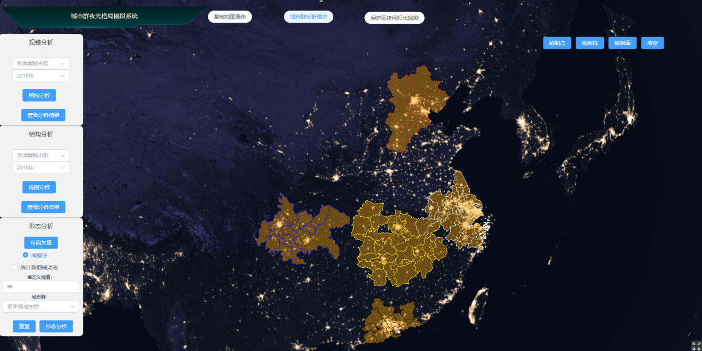
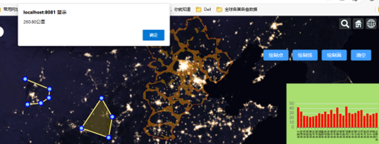
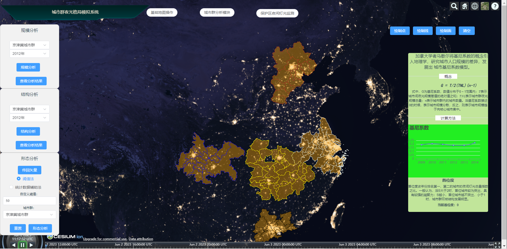
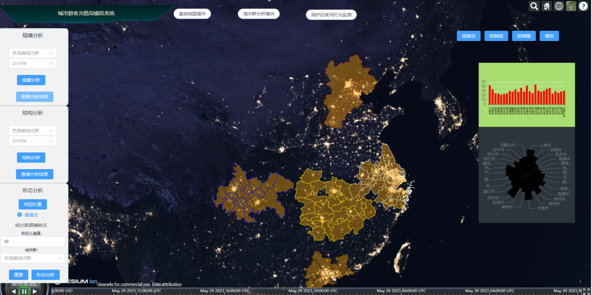
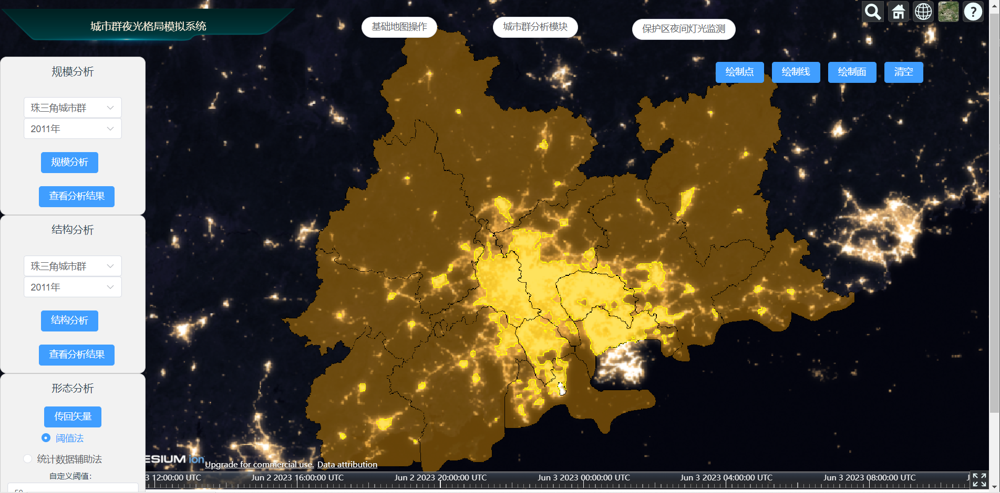
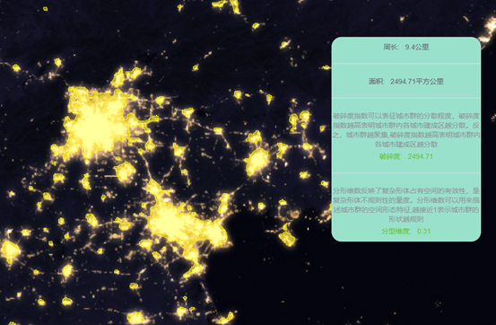

# WebGIS 课程作业 - 城市群夜光分析

本项目为布自强（202228006010024），高润钊（202228006010015）合作完成的网络地理信息系统（22-23春）课程作业。

本系统根据当前研究领域中的技术难度与痛点，有针对性地设计基于夜光遥感的城市群发展规律分析功能，能够有效地帮助相关研究者解决显示研究中的问题。城市群夜光格局模拟及制图系统主要包括地图基础功能和城市群夜光分析功能。地图基础功能包括地图放大、缩小、全图显示等浏览功能，夜间灯光数据及我国各大城市群矢量边界（京津冀城市群、长江中下游城市群、长江中游城市群、珠江三角洲城市群和成渝城市群）探查功能、地图测量（距离、面积）功能；夜光格局模拟功能主要包括城市群规模分析、城市群形态分析、城市群结构分析等。

本项目使用以下技术和工具：

- 后端框架：Spring Boot
- 前端框架：Vue
- 版本控制：Git
- 构建工具：Maven, Node.js

## 功能与操作指南

- 功能1:基础地图操作，用户可以通过Cesium的控件以及我们实现的绘制功能与网页进行交互
    - 显示京津冀城市群、长江三角洲城市群、长江中下游城市群、成渝城市群和珠江三角洲城市群五个城市群的矢量边界（默认初始界面）
  
        

    - 测量功能如面积测量，点击后，我们会对鼠标的MOUSE_MOVE等事件进行监听，当用户按下右键时，绘制完毕并显示测量结果
  
        

- 功能2:城市群分析模块，用户可以选择城市群和年份进行城市群的规模、结构和形态分析（由于夜间灯光影像数据较大本仓库中仅上传2009-2015年份数据用于演示）
    - 所有模块都有“分析”和“显示”按钮，分别用于将参数传至后台进行计算和在右侧弹出面板显示结果，以下是“规模分析”和“结构分析”结果示意

        

        

    - 在“形态分析”模块中，用户填入参数后（默认为50，即认为夜间灯光值$\ge 50$被认为是城市范围），点击“传回矢量”(step 1，这一步需要等待一定时间),后端传回计算好的城市建成区与周长、面积、破碎度、分形维度等参数(需要等待一段时间)，前端点击”分析“按钮（step 2）将数据显示在右侧面板
  
        

        

- 功能3: 保护区分析，未完工

## 安装与运行

以下是在本地环境中安装和运行该项目的步骤：

1. 克隆项目代码到本地机器：

    ```bash
    # frontend
    git clone https://github.com/yottahub/WebGIS-Backend
    # backend
    git clone https://github.com/yottahub/WebGIS-Frontend
    ```

    项目文件结构（前端）。

    ```bash
    . 
    ├── public # 网页加载资源 
    ├── src 
    │ ├── assets
    │ ├── components
    │ │ ├── earthpane.vue
    │ ├── App.vue
    │ └── main.js
    |
    ├── package.json
    └── vue.config.js

    ```

    项目文件结构（后端）。

    ```bash
    . 
    ├── pom.xml 
    ├── src 
    │ ├── lib # 本地jar包
    │ └── main 
    │   ├── java 
    │   │ └── cn.ac.ucas.webgis.server
    │   │      ├── WebGisProjectApplication.java
    │   │      ├── common 
    │   │      │ └── # 项目使用类
    │   │      ├── config 
    │   │      │ └── WebMvcConfig.java 
    │   │      └── controller 
    │   │        └── WebFeatureController.java
    │   ├── resources
    │   └── python # Python脚本
    |
    └── target
    ```

2. 本地搭建前端服务: 
    - 进入前端工程文件夹`Vue_Cesium`. 
        ```shell
        cd Vue_Cesium
        ```
    - 通过 `npm` 下载前端库依赖: 

        ```shell
        npm install
        ```
    - 于[http://localhost:8081](http://localhost:8081).端口运行前端服务
        ```shell
        npm run serve
        ```

3. Backend Setup: 

    - 本项目部分功能采用Java调用python的方式来实现，因此要求本地python安装对应的依赖库(GDAL，由于其所需依赖库较多使用pip安装不一定成功，可以使用homebrew等包管理应用进行下载，此外GDAL部分函数在Apple Silicon平台运行计算结果会存在错误，暂时无法解决该问题)，具体操作如下
        
        ```bash
        cd Webgis-Server/src/main/python
        pip install -r requirements.txt
        ```

    - 在IDEA中打开本项目并运行，项目默认使用Java 17，Springboot 3.0.4版本，实际Java 8以后的版本理论都可以运行（未实测）
        
        ```xml
        <parent>
            <groupId>org.springframework.boot</groupId>
            <artifactId>spring-boot-starter-parent</artifactId>
            <version>3.0.4</version>
            <relativePath/> <!-- lookup parent from repository -->
        </parent>
        <properties>
            <java.version>17</java.version>
        </properties>
        ```

    -  后端服务器部署于 [http://localhost:8090](http://localhost:8090).


Docker/Azure项目部署(to be continue...)

## 证书

This project is licensed under the [MIT License](LICENSE)

## 致谢

The project utilizes various open-source libraries and frameworks, including Vue.js, Cesium, and Spring Boot. Special thanks to the contributors and maintainers of these open-source projects for their valuable work.